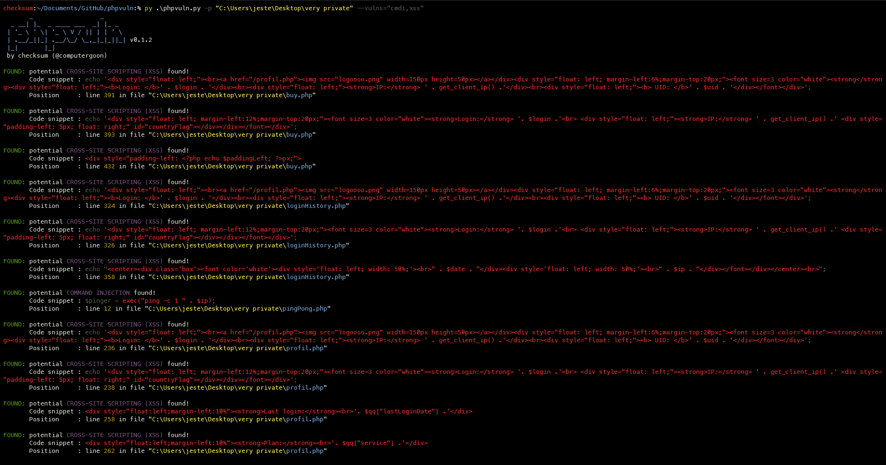

# phpvuln

[](https://www.python.org/)

phpvuln is an open source penetration testing tool that can automate the process of finding potential common PHP vulnerabilities in PHP code i.e. command injection, local/remote file inclusion, SQL injection etc.

## Screenshot



## Requirements

* Python 3
* Git (optional)
* PIP modules in requirements.txt

## Installation

You can download phpvuln by cloning the Git repository:

``` bash
git clone https://github.com/ecriminal/phpvuln.git
```

Install the required PIP packages:

``` bash
python -m  pip install -r requirements.txt
```

## Usage

To get the list of all options use:
 `python phpvuln.py -h`
